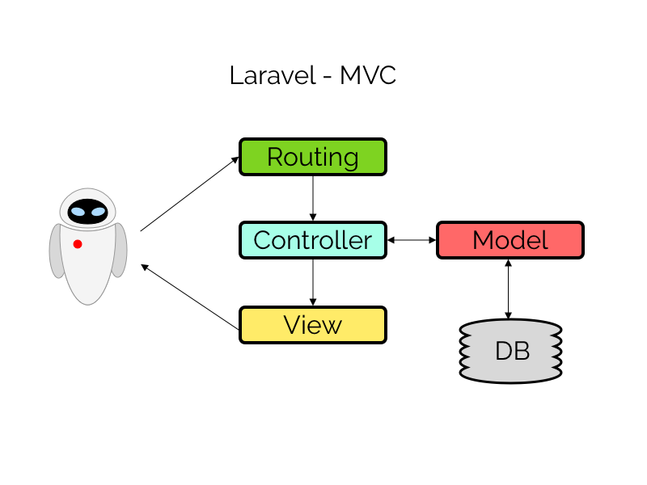

MVC is een design pattern om code op een bepaalde manier te structureren. Het pattern is opgedeeld in de volgende lagen.

* Model: definieert de representatie van de informatie waarmee de applicatie werkt.
* View: definieert de user-interface elementen die getoond worden.
* Controller: verwerkt en reageertop events.

Bron: <https://nl.wikipedia.org/wiki/Model-view-controller-model>

De samenhang in de lagen is getoond in het onderstaande plaatje. In dit plaatje doet een user (EVE) via een route (bijvoorbeeld http://mywebsite) een request naar de server. De route geeft dit request vervolgens door aan de controller. De controller kan dan gegevens via het model uit de database halen en doorgeven aan de view. Of de controller verwijst direct door naar een bepaalde view. De view wordt dan getoond in de browser van de gebruiker.

